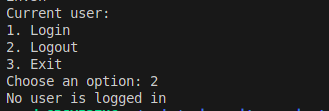
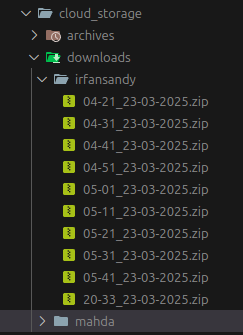

# Praktikum Modul 1 _(Module 1 Lab Work)_

[](https://classroom.github.com/a/Ph837wyE)

## Anggota Kelompok _(Team Members)_

|    NRP     |      Name      |
| :--------: | :------------: |
| 5025241127 | Mochammad Irfan Sandy |
| 5025241136 | Athar Bakhtiar Aziz |
| 5025241143 | Farras Nizar |
| 5025241164 | Alfianz Risqia Ilahi Loven Kary |

## Daftar Soal _(Task List)_

- [Task 1 - New Jeans Global Teratas _(Top Global New Jeans)_](/task-1/)

- [Task 2 - Liburan Bersama Rudi _(Holiday with Rudi)_](/task-2/)

- [Task 3 - Ignatius Si Cloud Engineer _(Ignatius The Cloud Engineer)_](/task-3/)

- [Task 4 - Proxy Terbaik di New Eridu _(Best Proxy in New Eridu)_](/task-4/)

---

## Laporan Resmi Praktikum Modul 1 _(Module 1 Lab Work Report)_

Laporan resmi praktikum modul 1 ini berisi penjelasan mengenai setiap task yang telah dikerjakan. Laporan ini juga berisi penjelasan mengenai cara menjalankan setiap task, serta hasil dari setiap task yang telah dikerjakan.

---

### Laporan Task 1 - New Jeans Global Teratas _(Top Global New Jeans)_

---

### Laporan Task 2 - Liburan Bersama Rudi _(Holiday with Rudi)_

---

### Laporan Task 3 - Ignatius Si Cloud Engineer _(Ignatius The Cloud Engineer)_

#### Deskripsi Program _(Program Description)_

Program ini adalah program dimana user bisa [login](./task-3/login.sh) dan [register](./task-3/register.sh) lalu menyimpannya ke dalam file `cloud_log.txt` yang dimana bila user login maka akan menyalakan crontab untuk menjalankan file [automation.sh](./task-3/automation.sh), [download.sh](./task-3/download.sh), dan [archive.sh](./task-3/archive.sh). `automation.sh` akan berjalan selama 2 menit sekali untuk mengecek apakah user sedang login. `download.sh` akan mendownload file nature dari google api selama 10 menit sekali. Dan `archive.sh` akan mengarsipkan file nature yang sudah di download ke dalam folder `./cloud_storage/downloads` selama 2 jam sekali. Program-program ini juga akan menampilkan log dari setiap proses yang terjadi di dalam file `cloud_log.txt`.

#### Diagram Alur Program Secara Keseluruhan _(Overall Program Flow Diagram)_


---

#### Penjelasan Program [register.sh](./task-3/register.sh) _([register.sh](./task-3/register.sh) Program Explanation)_


##### Kode Program register.sh _(register.sh Program Code)_

```bash
#!/bin/bash

dir=$( dirname -- "$( readlink -f -- "$0"; )"; )

init() {    
    if [ ! -e "$dir/cloud_log.txt" ]; then
        touch $dir/cloud_log.txt
    fi

    if [ ! -e "$dir/cloud_storage" ]; then
        mkdir -p $dir/cloud_storage
    fi

    if [ ! -e "$dir/cloud_storage/users.txt" ]; then 
        touch "$dir/cloud_storage/users.txt"
    fi
}

checkPassword() {
    local username=$1
    local password=$2
    
    if [ ${#password} -lt 8 ]; then
        echo "Password must be at least 8 characters long"
        echo "$currentTime REGISTER: ERROR Password is not 8 characters long" >> "$dir/cloud_log.txt"
        return 1
    elif ! [[ $password =~ [A-Z] ]]; then
        echo "Password must contain at least one uppercase letter"
        echo "$currentTime REGISTER: ERROR Password does not contain a single uppercase letter" >> "$dir/cloud_log.txt"
        return 1
    elif ! [[ $password =~ [0-9] ]]; then
        echo "Password must contain at least one number"
        echo "$currentTime REGISTER: ERROR Password does not contain a single number" >> "$dir/cloud_log.txt"
        return 1
    elif ! [[ $password =~ [[:punct:]] ]]; then
        echo "Password must contain at least one special character"
        echo "$currentTime REGISTER: ERROR Password does not contain a single special character" >> "$dir/cloud_log.txt"
        return 1
    elif [ "$password" = "$username" ]; then
        echo "Password cannot be the same as username"
        echo "$currentTime REGISTER: ERROR Password is the same as username" >> "$dir/cloud_log.txt"
        return 1
    elif [[ $password =~ [cC][lL][oO][uU][dD] ]] || [[ $password =~ [sS][tT][oO][rR][aA][gG][eE] ]]; then
        echo "Password cannot contain the words 'cloud' or 'storage'"
        echo "$currentTime REGISTER: ERROR Password contains 'cloud' or 'storage'" >> "$dir/cloud_log.txt"
        return 1
    fi
    return 0
}

checkUsername() {
    local username=$1
    if [ ! -s "$dir/cloud_storage/users.txt" ]; then
        return 0
    fi

    if [[ $username =~ [[:space:]/\\] ]]; then
        echo "Username cannot contain whitespaces, forward or backward slash"
        echo "$currentTime REGISTER: ERROR Username contained whitespaces, forward or backward slash" >> "$dir/cloud_log.txt"
        return 1
    fi

    grep -q "^${username}:" "$dir/cloud_storage/users.txt"

    if [ $? -eq 0 ]; then
        echo "User already exists"
        echo "$currentTime REGISTER: ERROR User already exists" >> "$dir/cloud_log.txt"
        return 1
    fi
    return 0
}

init
read -p "Enter username: " username
read -s -p "Enter password: " password
echo

if [ -z "$username" ] || [ -z "$password" ]; then
    echo "Username and password cannot be empty"
    exit 1
fi

currentTime=$(date +"%y/%m/%d %H:%M:%S")

if checkPassword "$username" "$password" && checkUsername "$username"; then
    echo "Successfully registered"
    echo "$currentTime REGISTER: INFO User registered successfully" >> "$dir/cloud_log.txt"
    password=$(echo -n "$password" | openssl dgst -sha256 | cut -d "=" -f 2)
    echo "$username:$password" >> "$dir/cloud_storage/users.txt"
fi
```

##### Bagian Awal _(First Section)_

```bash
#!/bin/bash

dir=$( dirname -- "$( readlink -f -- "$0"; )"; )
```

`#!/bin/bash` adalah shebang yang digunakan untuk memberitahu sistem bahwa file ini adalah file script untuk `/bin/bash`. `dir=$( dirname -- "$( readlink -f -- "$0"; )"; )` digunakan untuk mendapatkan direktori dari file script ini. `readlink -f` digunakan untuk mendapatkan path absolut dari file script ini, dan `dirname` digunakan untuk mendapatkan direktori dari path tersebut. `$0` digunakan untuk menunjuk pada file ini dan `--` digunakan untuk option escape jika sebuah file atau folder memiliki nama yang diawali dengan `-` _(minus)_. `$(...)` adalah command substitution yang digunakan untuk mengeksekusi perintah didalamnya dan mengembalikan hasilnya.

##### Fungsi init() register.sh _(register.sh init() Function)_

Fungsi `init()` digunakan untuk menginisialisasi file `cloud_log.txt`, folder `cloud_storage`, dan file `cloud_storage/users.txt` jika belum dibuat.

```bash
if [ ! -e "$dir/cloud_log.txt" ]; then
    touch $dir/cloud_log.txt
fi
if [ ! -e "$dir/cloud_storage" ]; then
    mkdir -p $dir/cloud_storage
fi
if [ ! -e "$dir/cloud_storage/users.txt" ]; then 
    touch "$dir/cloud_storage/users.txt"
fi
```

`[]` Kurung kotak diatas menunjukkan bahwa operasi ini adalah operasi kondisi true or false.  `! -e` pada kode diatas menjelaskan jika file atau folder tidak ada. `touch` digunakan untuk membuar file baru, dan `mkdir -p` digunakan untuk membuat folder baru dimana `-p` digunakan agar tidak menumpuk _(overwrite)_ folder yang sudah ada.

##### Fungsi checkPassword() _(checkPassword() Function)_

Fungsi `checkPassword()` digunakan untuk mengecek apakah password memenuhi syarat yang telah ditentukan. Jika tidak, maka akan mengembalikan nilai 1 _(false)_ dan menuliskan pesan kesalahan ke dalam file `cloud_log.txt`.

```bash
local username=$1
local password=$2

if [ ${#password} -lt 8 ]; then
    echo "Password must be at least 8 characters long"
    echo "$currentTime REGISTER: ERROR Password is not 8 characters long" >> "$dir/cloud_log.txt"
    return 1
elif ! [[ $password =~ [A-Z] ]]; then
    echo "Password must contain at least one uppercase letter"
    echo "$currentTime REGISTER: ERROR Password does not contain a single uppercase letter" >> "$dir/cloud_log.txt"
    return 1
elif ! [[ $password =~ [0-9] ]]; then
    echo "Password must contain at least one number"
    echo "$currentTime REGISTER: ERROR Password does not contain a single number" >> "$dir/cloud_log.txt"
    return 1
elif ! [[ $password =~ [[:punct:]] ]]; then
    echo "Password must contain at least one special character"
    echo "$currentTime REGISTER: ERROR Password does not contain a single special character" >> "$dir/cloud_log.txt"
    return 1
elif [ "$password" = "$username" ]; then
    echo "Password cannot be the same as username"
    echo "$currentTime REGISTER: ERROR Password is the same as username" >> "$dir/cloud_log.txt"
    return 1
elif [[ $password =~ [cC][lL][oO][uU][dD] ]] || [[ $password =~ [sS][tT][oO][rR][aA][gG][eE] ]]; then
    echo "Password cannot contain the words 'cloud' or 'storage'"
    echo "$currentTime REGISTER: ERROR Password contains 'cloud' or 'storage'" >> "$dir/cloud_log.txt"
    return 1
fi
return 0
```

`local` pada kode diatas digunakan untuk mendeklarasikan variabel lokal yang hanya bisa diakses didalam fungsi tersebut. `username=$1` dan `password=$2` digunakan untuk mengambil argumen yang diberikan pada saat pemanggilan fungsi  (`checkPassword "$username" "$password"`). `if [ ${#password} -lt 8 ]` digunakan untuk mengecek apakah panjang password kurang dari 8 karakter. `${#password}` digunakan untuk menghitung panjang dari variabel `password`. `-lt` adalah operator perbandingan yang berarti less than _(kurang dari)_. `! [[ $password =~ [A-Z] ]]` digunakan untuk mengecek apakah `$password` tidak mengandung huruf kapital. `[[ $password =~ [A-Z] ]]` adalah regex yang digunakan untuk mencocokkan pola pada string. `=~` adalah operator yang digunakan untuk mencocokkan string dengan regex. `[]` pada regex adalah list yang digunakan untuk matching semua bagian teks dengan salah satu isi list regex. Dan `[[]]` digunakan untuk melakukan operasi kondisi yang tidak sesuai standard POSIX. `elif ! [[ $password =~ [0-9] ]]` digunakan untuk mengecek apakah `$password` tidak mengandung angka. `elif ! [[ $password =~ [[:punct:]] ]]` digunakan untuk mengecek apakah `$password` tidak mengandung karakter spesial. `:punct:` adalah POSIX character class dimana itu merepresentasikan semua karakter spesial. `elif [ "$password" = "$username" ]` digunakan untuk mengecek apakah `$password` sama dengan `$username`. `elif [[ $password =~ [cC][lL][oO][uU][dD] ]] || [[ $password =~ [sS][tT][oO][rR][aA][gG][eE] ]]` digunakan untuk mengecek apakah `$password` mengandung kata cloud atau storage. `return 1` digunakan untuk mengembalikan nilai 1 _(false)_ jika salah satu syarat diatas tidak terpenuhi.

##### Fungsi checkUsername() _(checkUsername() Function)_

Fungsi `checkUsername()` digunakan untuk mengecek apakah username sudah ada atau belum. Jika sudah ada, maka akan mengembalikan nilai 1 _(false)_ dan menuliskan pesan kesalahan ke dalam file `cloud_log.txt`.

```bash
local username=$1
if [ ! -s "$dir/cloud_storage/users.txt" ]; then
    return 0
fi

if [[ $username =~ [[:space:]/\\] ]]; then
    echo "Username cannot contain whitespaces, forward or backward slash"
    echo "$currentTime REGISTER: ERROR Username contained whitespaces, forward or backward slash" >> "$dir/cloud_log.txt"
    return 1
fi

grep -q "^${username}:" "$dir/cloud_storage/users.txt"

if [ $? -eq 0 ]; then
    echo "User already exists"
    echo "$currentTime REGISTER: ERROR User already exists" >> "$dir/cloud_log.txt"
    return 1
fi
return 0
```

`if [ ! -s "$dir/cloud_storage/users.txt" ]` digunakan untuk mengecek apakah file `users.txt` kosong. Jika kosong, maka akan mengembalikan nilai 0 _(true)_. `if [[ $username =~ [[:space:]/\\] ]]` digunakan untuk mengecek apakah `$username` mengandung whitespace `[:space:]`, forward slash `/`, atau backward slash `\\`. `grep -q "^${username}:" "$dir/cloud_storage/users.txt"` digunakan untuk mengecek apakah `$username` sudah ada di dalam file `users.txt`. `grep` adalah global regular expression print yang digunakan untuk mencari 1 line pada file. `-q` digunakan untuk membuat grep silent. `^` digunakan untuk mencocokkan awal dari string pada regex. `if [ $? -eq 0 ]` digunakan untuk mengecek status command terakhir. `$?` digunakan untuk mengecek status dari perintah terakhir yang dijalankan. Jika statusnya 0 _(true)_, maka username sudah ada di dalam file `users.txt`. `-eq` adalah operator perbandingan yang berarti equal to _(sama dengan)_.

##### Bagian Utama Program register.sh _(register.sh Main Program Code)_

```bash
init
read -p "Enter username: " username
read -s -p "Enter password: " password
echo

if [ -z "$username" ] || [ -z "$password" ]; then
    echo "Username and password cannot be empty"
    exit 1
fi

currentTime=$(date +"%y/%m/%d %H:%M:%S")

if checkPassword "$username" "$password" && checkUsername "$username"; then
    echo "Successfully registered"
    echo "$currentTime REGISTER: INFO User registered successfully" >> "$dir/cloud_log.txt"
    password=$(echo -n "$password" | openssl dgst -sha256 | cut -d "=" -f 2)
    echo "$username:$password" >> "$dir/cloud_storage/users.txt"
fi
```

`read -p "Enter username: " username` digunakan untuk meminta input username, `-p` adalah parameter yang digunakan untuk mendapat input dari terminal. `read -s -p "Enter password: " password` digunakan untuk meminta input password dari user tanpa menampilkan karakter yang diketikkan. `-s` adalah option secret yang digunakan untuk menyembunyikan input seperti password. `echo` digunakan untuk menampilkan newline setelah input password. `if [ -z "$username" ] || [ -z "$password" ]` digunakan untuk mengecek apakah username atau password kosong. Jika kosong, maka akan menampilkan pesan kesalahan dan keluar dari program dengan status 1 _(false)_. `-z` adalah parameter yang digunakan untuk mengecek apakah variable kosong.`currentTime=$(date +"%y/%m/%d %H:%M:%S")` digunakan untuk mendapatkan waktu saat ini dengan format `yy/mm/dd HH:MM:SS`. Command `date` digunakan untuk mengeluarkan waktu sekarang. `+` adalah parameter yang digunakan untuk memberitahu command bahwa format tanggalnya seperti string selanjutnya. `if checkPassword "$username" "$password" && checkUsername "$username"` digunakan untuk mengecek apakah password dan username valid. Jika valid, maka akan menampilkan pesan sukses dan menuliskan pesan ke dalam file `cloud_log.txt`. `password=$(echo -n "$password" | openssl dgst -sha256 | cut -d "=" -f 2)` digunakan untuk mengenkripsi password dengan algoritma SHA-256. `echo -n` digunakan untuk mengeluarkan string tanpa newline. `|` adalah pipeline pada linux, operator ini digunakan untuk passing output stdout `echo` ke command selanjutnya. `cut -d "=" -f 2` digunakan untuk memotong string yang dihasilkan oleh command sebelumnya dengan delimiter `=` dan mengambil field ke-2. `echo` digunakan untuk mengeluarkan text ke dalam terminal. Dalam konteks ini `echo` digunakan untuk mengeluarkan teks kedalam `cloud_storage/users.txt`. `>>` digunakan untuk menambahkan text ke dalam file.

##### Hasil register.sh _(register.sh Result)_

Berikut merupakan hasil dari program `register.sh` yang telah dijalankan. Yaitu berupa hasil dari beberapa test case yang dicoba.


Berikut juga hasil dari file `cloud_storage/users.txt` yang dihasilkan dari program `register.sh` diatas.


---

#### Penjelasan Program [login.sh](./task-3/login.sh) _([login.sh](./task-3/login.sh) Program Explanation)_


##### Kode Program login.sh _(login.sh Program Code)_

```bash
#!/bin/bash

dir=$( dirname -- "$( readlink -f -- "$0"; )"; )

init() {    
    if [ ! -e "$dir/cloud_log.txt" ] || [ ! -e "$dir/cloud_storage" ] || [ ! -e "$dir/cloud_storage/users.txt" ]; then
        echo "No users have been created, register first"
        exit 1
    fi
}

userLogin() {
    read -p "Enter username: " username
    read -s -p "Enter password: " password
    echo
    if [ -z "$username" ] || [ -z "$password" ]; then
        echo "Username or password cannot be empty"
        echo "$currentTime LOGIN: ERROR Failed login attempt on user $username" >> "$dir/cloud_log.txt"
        exit 1
    fi
    if [ $isLoggedIn -eq 1 ]; then
        passwordHash=$(echo -n "$password" | openssl dgst -sha256 | cut -d "=" -f 2)
        grep -q "^$username:$passwordHash" "$dir/cloud_storage/users.txt"
        if [ $? -eq 0 ]; then
            echo "Login successful"
            echo "$currentTime LOGIN: INFO User $username logged in" >> "$dir/cloud_log.txt"
            currentUser="$username"
            ${dir}/init.sh
            return 0
        else
            echo "Invalid username or password"
            echo "$currentTime LOGIN: ERROR Failed login attempt on user $username" >> "$dir/cloud_log.txt"
            exit 1
        fi
    elif [ "$currentUser" = "$username" ]; then
        echo "You are already logged in as $currentUser"
        exit 1
    else 
        echo "Another user ($currentUser) is already logged in, Only one user can be logged in at a time"
        echo "$currentTime LOGIN: ERROR Failed login attempt on user $username" >> "$dir/cloud_log.txt"
        exit 1
    fi
    return 0
}

logout_() {
    if [ -z "$currentUser" ]; then
        echo "No user is logged in"
        return 1
    fi

    echo "Goodbye, $currentUser!"
    echo "$currentTime LOGOUT: INFO User $currentUser logged out" >> "$dir/cloud_log.txt"
    currentUser=""
    return 0
}

# Logged in = 0, Logged Out = 1
checkIfUserLoggedIn() {
    local lastLogin=$(grep "LOGIN: INFO User" "$dir/cloud_log.txt" | tail -n 1)
    local lastLogout=$(grep "LOGOUT: INFO User" "$dir/cloud_log.txt" | tail -n 1)

    if [ -z "$lastLogin" ]; then
        return 1
    elif [ -z "$lastLogout" ]; then
        currentUser=$(echo "$lastLogin" | awk '{print $6}')
        return 0
    else
        loginTime=$(echo "$lastLogin" | awk '{print $1 " " $2}')
        logoutTime=$(echo "$lastLogout" | awk '{print $1 " " $2}')
        
        if [[ "$loginTime" > "$logoutTime" ]]; then
            currentUser=$(echo "$lastLogin" | awk '{print $6}')
            return 0
        fi
    fi
    return 1
}

init
currentTime=$(date +"%y/%m/%d %H:%M:%S")
checkIfUserLoggedIn
isLoggedIn=$?
echo "Current user: $currentUser"
echo "1. Login"
echo "2. Logout"
echo "3. Exit"
read -p "Choose an option: " choice
case $choice in
    1) userLogin ;;
    2) logout_ ;;
    3) echo "exiting program.."; exit 0 ;;
    *) echo "Invalid choice"; exit 1 ;;
esac
exit $?
```

##### Fungsi init() login.sh _(login.sh init() Function)_

Fungsi `init()` digunakan untuk menginisialisasi file `cloud_log.txt`, folder `cloud_storage`, dan file `cloud_storage/users.txt` jika belum dibuat. Jika tidak ada, maka akan menampilkan pesan kesalahan dan keluar dari program.

```bash
if [ ! -e "$dir/cloud_log.txt" ] || [ ! -e "$dir/cloud_storage" ] || [ ! -e "$dir/cloud_storage/users.txt" ]; then
    echo "No users have been created, register first"
    exit 1
fi
```

`if [ ! -e "$dir/cloud_log.txt" ] || [ ! -e "$dir/cloud_storage" ] || [ ! -e "$dir/cloud_storage/users.txt" ]` digunakan untuk mengecek apakah file `cloud_log.txt`, folder `cloud_storage`, dan file `cloud_storage/users.txt` ada. Jika tidak ada, maka akan menampilkan pesan kesalahan dan keluar dari program dengan status 1 _(false)_.

##### Fungsi userLogin() _(userLogin() Function)_

Fungsi `userLogin()` digunakan untuk meminta input username dan password dari user. Jika username atau password kosong, maka akan menampilkan pesan kesalahan dan keluar dari program. Jika user sudah login, maka akan mengecek apakah username yang dimasukkan sama dengan username yang sedang login. Jika sama, maka akan menampilkan pesan bahwa user sudah login. Jika tidak, maka akan menampilkan pesan bahwa user lain sudah login.

```bash
read -p "Enter username: " username
read -s -p "Enter password: " password
echo

if [ -z "$username" ] || [ -z "$password" ]; then
    echo "Username or password cannot be empty"
    echo "$currentTime LOGIN: ERROR Failed login attempt on user $username" >> "$dir/cloud_log.txt"
    exit 1
fi

if [ $isLoggedIn -eq 1 ]; then
    passwordHash=$(echo -n "$password" | openssl dgst -sha256 | cut -d "=" -f 2)
    grep -q "^$username:$passwordHash" "$dir/cloud_storage/users.txt"
    if [ $? -eq 0 ]; then
        echo "Login successful"
        echo "$currentTime LOGIN: INFO User $username logged in" >> "$dir/cloud_log.txt"
        currentUser="$username"
        ${dir}/init.sh
        return 0
    else
        echo "Invalid username or password"
        echo "$currentTime LOGIN: ERROR Failed login attempt on user $username" >> "$dir/cloud_log.txt"
        exit 1
    fi
elif [ "$currentUser" = "$username" ]; then
    echo "You are already logged in as $currentUser"
    exit 1
else 
    echo "Another user ($currentUser) is already logged in, Only one user can be logged in at a time"
    echo "$currentTime LOGIN: ERROR Failed login attempt on user $username" >> "$dir/cloud_log.txt"
    exit 1
fi

return 0
```

`read -p "Enter username: " username` digunakan untuk meminta input username, `-p` adalah parameter yang digunakan untuk mendapat input dari terminal. `read -s -p "Enter password: " password` digunakan untuk meminta input password dari user tanpa menampilkan karakter yang diketikkan. `-s` adalah option secret yang digunakan untuk menyembunyikan input seperti password. `if [ -z "$username" ] || [ -z "$password" ]` digunakan untuk mengecek apakah username atau password kosong. Jika kosong, maka akan menampilkan pesan kesalahan dan keluar dari program dengan status 1 _(false)_. `-z` adalah parameter yang digunakan untuk mengecek apakah variable kosong. `if [ $isLoggedIn -eq 1 ]` digunakan untuk mengecek apakah user sudah login. Jika sudah login, maka akan mengecek apakah username dan password sesuai dengan yang ada di dalam file `users.txt`. Jika sesuai pada file `users.txt`, maka akan menampilkan
pesan sukses dan menuliskan pesan ke dalam file `cloud_log.txt`. `grep -q "^$username:$passwordHash" "$dir/cloud_storage/users.txt"` digunakan untuk mengecek apakah `$username` dan `$passwordHash` sudah ada di dalam file `users.txt`. Jika tidak ada maka akan menampilkan error dan menuliskannya ke `cloud_log.txt`. `currentUser="$username"` digunakan untuk menyimpan username yang sedang login ke dalam variabel `currentUser`. `${dir}/init.sh` digunakan untuk menjalankan file `init.sh` yang berfungsi untuk menginisialisasi crontab. `elif [ "$currentUser" = "$username" ]` digunakan untuk mengecek apakah username yang dimasukkan sama dengan username yang sedang login. Jika sama, maka akan menampilkan pesan bahwa user sudah login. `else` digunakan untuk menampilkan pesan bahwa user lain sudah login.

##### Fungsi logout_() _(logout_() Function)_

Fungsi `logout_()` digunakan untuk melakukan logout dari user yang sedang login. Jika tidak ada user yang login, maka akan menampilkan pesan bahwa tidak ada user yang login.

```bash
if [ -z "$currentUser" ]; then
    echo "No user is logged in"
    return 1
fi

echo "Goodbye, $currentUser!"
echo "$currentTime LOGOUT: INFO User $currentUser logged out" >> "$dir/cloud_log.txt"
currentUser=""
return 0
```

`if [ -z "$currentUser" ]` digunakan untuk mengecek apakah tidak ada user yang login. Jika tidak ada, maka akan menampilkan pesan bahwa tidak ada user yang login. `echo "Goodbye, $currentUser!"` digunakan untuk menampilkan pesan selamat tinggal kepada user yang sedang login. `echo "$currentTime LOGOUT: INFO User $currentUser logged out" >> "$dir/cloud_log.txt"` digunakan untuk menuliskan pesan logout ke dalam file `cloud_log.txt`. `currentUser=""` digunakan untuk mengosongkan variabel `currentUser`.

##### Fungsi checkIfUserLoggedIn() _(checkIfUserLoggedIn() Function)_

Fungsi `checkIfUserLoggedIn()` digunakan untuk mengecek apakah ada user yang sedang login atau tidak. Jika ada, maka akan mengembalikan nilai 0 _(true)_ dan menyimpan username yang sedang login ke dalam variabel `currentUser`. Jika tidak ada, maka akan mengembalikan nilai 1 _(false)_.

```bash
local lastLogin=$(grep "LOGIN: INFO User" "$dir/cloud_log.txt" | tail -n 1)
local lastLogout=$(grep "LOGOUT: INFO User" "$dir/cloud_log.txt" | tail -n 1)

if [ -z "$lastLogin" ]; then
    return 1
elif [ -z "$lastLogout" ]; then
    currentUser=$(echo "$lastLogin" | awk '{print $6}')
    return 0
else
    loginTime=$(echo "$lastLogin" | awk '{print $1 " " $2}')
    logoutTime=$(echo "$lastLogout" | awk '{print $1 " " $2}')
    
    if [[ "$loginTime" > "$logoutTime" ]]; then
        currentUser=$(echo "$lastLogin" | awk '{print $6}')
        return 0
    fi
fi
return 1
```

`local lastLogin=$(grep "LOGIN: INFO User" "$dir/cloud_log.txt" | tail -n 1)` digunakan untuk mengambil baris terakhir dari file `cloud_log.txt` yang mengandung kata `LOGIN: INFO User`. `tail -n 1` digunakan untuk mengambil 1 baris terakhir dari hasil grep. `if [ -z "$lastLogin" ]` digunakan untuk mengecek apakah tidak ada user yang login. Jika tidak ada, maka akan mengembalikan nilai 1 _(false)_. `elif [ -z "$lastLogout" ]` digunakan untuk mengecek apakah tidak ada user yang logout. Jika tidak ada, maka akan menyimpan username yang sedang login ke dalam variabel `currentUser`. `currentUser=$(echo "$lastLogin" | awk '{print $6}')` digunakan untuk mengambil username dari baris terakhir yang mengandung kata `LOGIN: INFO User`. `awk '{print $6}'` digunakan untuk mengambil kolom ke-6 (`$6`) dari hasil grep. `awk` sendiri adalah scripting language untuk `bash` yang digunakan untuk memproses data. `else` digunakan untuk mengecek apakah ada user yang logout. `loginTime=$(echo "$lastLogin" | awk '{print $1 " " $2}')` digunakan untuk mengambil waktu login dari baris terakhir yang mengandung kata `LOGIN: INFO User`. `logoutTime=$(echo "$lastLogout" | awk '{print $1 " " $2}')` digunakan untuk mengambil waktu logout dari baris terakhir yang mengandung kata `LOGOUT: INFO User`. `if [[ "$loginTime" > "$logoutTime" ]]` digunakan untuk mengecek apakah waktu login lebih besar dari waktu logout. Jika lebih besar, maka akan menyimpan username yang sedang login ke dalam variabel `currentUser`.

##### Bagian Utama Program login.sh _(login.sh Main Program Code)_

```bash
init
currentTime=$(date +"%y/%m/%d %H:%M:%S")
checkIfUserLoggedIn
isLoggedIn=$?
echo "Current user: $currentUser"
echo "1. Login"
echo "2. Logout"
echo "3. Exit"
read -p "Choose an option: " choice
case $choice in
    1) userLogin ;;
    2) logout_ ;;
    3) echo "exiting program.."; exit 0 ;;
    *) echo "Invalid choice"; exit 1 ;;
esac
exit $?
```

`currentTime=$(date +"%y/%m/%d %H:%M:%S")` digunakan untuk mendapatkan waktu saat ini dengan format `yy/mm/dd HH:MM:SS`. Command `date` digunakan untuk mengeluarkan waktu sekarang. `+` adalah parameter yang digunakan untuk memberitahu command bahwa format tanggalnya seperti string selanjutnya. `checkIfUserLoggedIn` digunakan untuk mengecek apakah ada user yang sedang login atau tidak. `isLoggedIn=$?` digunakan untuk menyimpan status dari fungsi `checkIfUserLoggedIn`. `$?` digunakan untuk mengecek status dari perintah terakhir yang dijalankan. Jika statusnya 0 _(true)_, maka ada user yang sedang login. Jika statusnya 1 _(false)_, maka tidak ada user yang sedang login. `echo "Current user: $currentUser"` digunakan untuk menampilkan username yang sedang login. `read -p "Choose an option: " choice` digunakan untuk meminta input pilihan dari user. `case $choice in ... esac` digunakan untuk mengecek pilihan dari user. Jika pilihan 1, maka akan memanggil fungsi `userLogin`. Jika pilihan 2, maka akan memanggil fungsi `logout_`. Jika pilihan 3, maka akan keluar dari program dengan status 0 _(true)_. Jika pilihan tidak valid maka akan keluar dari program dengan statu 1 _(false)_.
`exit $?` digunakan untuk keluar dari program dengan status yang sama dengan status terakhir yang dijalankan.

##### Hasil login.sh _(login.sh Result)_

Berikut keadaan file `cloud_storage/users.txt` saat program `login.sh` dijalankan.


Berikut adalah hasil dari program `login.sh` yang telah dijalankan. Yaitu berupa hasil dari beberapa test case yang dicoba.

Login success:


Login failed:


Logout success:


Logout failed:



Exited program:


---

#### Penjelasan Program [automation.sh](./task-3/automation.sh) _([automation.sh](./task-3/automation.sh) Program Explanation)_


##### Kode Program automation.sh _(automation.sh Program Code)_

```bash
#!/bin/bash

dir=$( dirname -- "$( readlink -f -- "$0"; )"; )

init() {    
    if [ ! -e "$dir/cloud_log.txt" ] || [ ! -e "$dir/cloud_storage" ] || [ ! -e "$dir/cloud_storage/users.txt" ]; then
        exit 1
    fi
}

whenLoggedIn() {
    echo "$currentTime STATUS: INFO $currentUser is logged in" >> "$dir/cloud_log.txt"
    echo "SHELL=/bin/bash
    PATH=/usr/local/sbin:/usr/local/bin:/usr/sbin:/usr/bin:/sbin:/bin

    */2 * * * * /bin/bash $dir/automation.sh >> $dir/cloud_log.txt
    1-59/10 * * * * /bin/bash $dir/download.sh >> $dir/cloud_log.txt
    3 */2 * * * /bin/bash $dir/archive.sh >> $dir/cloud_log.txt
    " > /tmp/tempCrontab
    crontab /tmp/tempCrontab
    rm /tmp/tempCrontab
    exit 0
}

whenLoggedOut() {
    echo "$currentTime STATUS: ERROR No user is logged in" >> "$dir/cloud_log.txt"
    echo "SHELL=/bin/bash
    PATH=/usr/local/sbin:/usr/local/bin:/usr/sbin:/usr/bin:/sbin:/bin

    */2 * * * * /bin/bash $dir/automation.sh >> $dir/cloud_log.txt
    " > /tmp/tempCrontab
    crontab /tmp/tempCrontab
    rm /tmp/tempCrontab
    exit 1
}

checkIfUserLoggedIn() {
    local lastLogin=$(grep "LOGIN: INFO User" "$dir/cloud_log.txt" | tail -n 1)
    local lastLogout=$(grep "LOGOUT: INFO User" "$dir/cloud_log.txt" | tail -n 1)

    if [ -z "$lastLogin" ]; then
        whenLoggedOut
    elif [ -z "$lastLogout" ]; then
        currentUser=$(echo "$lastLogin" | awk '{print $6}')
        whenLoggedIn
    else
        loginTime=$(echo "$lastLogin" | awk '{print $1 " " $2}')
        logoutTime=$(echo "$lastLogout" | awk '{print $1 " " $2}')
        
        if [[ "$loginTime" > "$logoutTime" ]]; then
            currentUser=$(echo "$lastLogin" | awk '{print $6}')
            whenLoggedIn
        else 
            whenLoggedOut
        fi
    fi
    return 1
}

init
currentTime=$(date +"%y/%m/%d %H:%M:%S")
checkIfUserLoggedIn
exit 1
```

##### Fungsi whenLoggedIn() _(whenLoggedIn() Function)_

Fungsi `whenLoggedIn()` digunakan untuk mengatur crontab ketika user sedang login. Jika user login, maka akan menuliskan pesan ke dalam file `cloud_log.txt` dan mengatur crontab untuk menjalankan file `automation.sh`, `download.sh`, dan `archive.sh`.

```bash
echo "$currentTime STATUS: INFO $currentUser is logged in" >> "$dir/cloud_log.txt"
echo "SHELL=/bin/bash
PATH=/usr/local/sbin:/usr/local/bin:/usr/sbin:/usr/bin:/sbin:/bin

*/2 * * * * /bin/bash $dir/automation.sh >> $dir/cloud_log.txt
1-59/10 * * * * /bin/bash $dir/download.sh >> $dir/cloud_log.txt
3 */2 * * * /bin/bash $dir/archive.sh >> $dir/cloud_log.txt
" > /tmp/tempCrontab
crontab /tmp/tempCrontab
rm /tmp/tempCrontab
exit 0
```

`echo` pertama befungsi untuk menulis log kedalam file `cloud_log.txt` dengan cara di append menggunakan `>>`. `echo` kedua berfungsi untuk menulis crontab kedalam file `/tmp/tempCrontab`. `>` adalah operator yang digunakan untuk membuat sekaligus _overwrite_ file yang bernama sama.`SHELL=/bin/bash` digunakan untuk memberitahu crontab bahwa shell yang digunakan adalah `/bin/bash`.`PATH=/usr/local/sbin:/usr/local/bin:/usr/sbin:/usr/bin:/sbin:/bin` digunakan untuk memberitahu crontab bahwa program program yang digunakan kode bash ada di situ. `*/2 * * * * /bin/bash $dir/automation.sh >> $dir/cloud_log.txt` digunakan untuk menjalankan file `automation.sh` setiap 2 menit dan menuliskan log ke dalam file `cloud_log.txt`. `1-59/10 * * * * /bin/bash $dir/download.sh >> $dir/cloud_log.txt` digunakan untuk menjalankan file `download.sh` setiap 10 menit dengan offset 1 menit dan menuliskan log ke dalam file `cloud_log.txt`. `3 */2 * * * /bin/bash $dir/archive.sh >> $dir/cloud_log.txt` digunakan untuk menjalankan file `archive.sh` setiap 2 jam dengan offset 3 menit dan menuliskan log ke dalam file `cloud_log.txt`. `crontab /tmp/tempCrontab` digunakan untuk mengatur crontab dengan file yang telah dibuat sebelumnya. `rm /tmp/tempCrontab` digunakan untuk menghapus file sementara yang telah dibuat.

##### Fungsi whenLoggedOut() _(whenLoggedOut() Function)_

Fungsi `whenLoggedOut()` digunakan untuk mengatur crontab ketika user sedang logout. Jika user logout, maka akan menuliskan pesan ke dalam file `cloud_log.txt` dan mengatur crontab untuk menjalankan file `automation.sh`.

```bash
echo "$currentTime STATUS: ERROR No user is logged in" >> "$dir/cloud_log.txt"
echo "SHELL=/bin/bash
PATH=/usr/local/sbin:/usr/local/bin:/usr/sbin:/usr/bin:/sbin:/bin

*/2 * * * * /bin/bash $dir/automation.sh >> $dir/cloud_log.txt
" > /tmp/tempCrontab
crontab /tmp/tempCrontab
rm /tmp/tempCrontab
exit 1
```

`echo` pertama befungsi untuk menulis log kedalam file `cloud_log.txt` dengan cara di append menggunakan `>>`. `echo` kedua berfungsi untuk menulis crontab kedalam file `/tmp/tempCrontab`. `>` adalah operator yang digunakan untuk membuat sekaligus _overwrite_ file yang bernama sama.`SHELL=/bin/bash` digunakan untuk memberitahu crontab bahwa shell yang digunakan adalah `/bin/bash`.`PATH=/usr/local/sbin:/usr/local/bin:/usr/sbin:/usr/bin:/sbin:/bin` digunakan untuk memberitahu crontab bahwa program program yang digunakan kode bash ada di situ. `*/2 * * * * /bin/bash $dir/automation.sh >> $dir/cloud_log.txt` digunakan untuk menjalankan file `automation.sh` setiap 2 menit dan menuliskan log ke dalam file `cloud_log.txt`. `crontab /tmp/tempCrontab` digunakan untuk mengatur crontab dengan file yang telah dibuat sebelumnya. `rm /tmp/tempCrontab` digunakan untuk menghapus file sementara yang telah dibuat.

##### Fungsi checkIfUserLoggedIn()  _(checkIfUserLoggedIn() Function)_

Fungsi `checkIfUserLoggedIn()` digunakan untuk mengecek apakah ada user yang sedang login atau tidak. Jika ada, maka akan mengembalikan nilai 0 _(true)_ dan menyimpan username yang sedang login ke dalam variabel `currentUser`. Jika tidak ada, maka akan mengembalikan nilai 1 _(false)_.

```bash
local lastLogin=$(grep "LOGIN: INFO User" "$dir/cloud_log.txt" | tail -n 1)
local lastLogout=$(grep "LOGOUT: INFO User" "$dir/cloud_log.txt" | tail -n 1)
if [ -z "$lastLogin" ]; then
    whenLoggedOut
elif [ -z "$lastLogout" ]; then
    currentUser=$(echo "$lastLogin" | awk '{print $6}')
    whenLoggedIn
else
    loginTime=$(echo "$lastLogin" | awk '{print $1 " " $2}')
    logoutTime=$(echo "$lastLogout" | awk '{print $1 " " $2}')
    
    if [[ "$loginTime" > "$logoutTime" ]]; then
        currentUser=$(echo "$lastLogin" | awk '{print $6}')
        whenLoggedIn
    else 
        whenLoggedOut
    fi
fi
return 1
```

`local lastLogin=$(grep "LOGIN: INFO User" "$dir/cloud_log.txt" | tail -n 1)` digunakan untuk mengambil baris terakhir dari file `cloud_log.txt` yang mengandung kata `LOGIN: INFO User`. `tail -n 1` digunakan untuk mengambil 1 baris terakhir dari hasil grep. `if [ -z "$lastLogin" ]` digunakan untuk mengecek apakah tidak ada user yang login. Jika tidak ada, maka akan menjalankan fungsi `whenLoggedOut()`. `elif [ -z "$lastLogout" ]` digunakan untuk mengecek apakah tidak ada user yang logout. Jika tidak ada, maka akan menyimpan username yang sedang login ke dalam variabel `currentUser`. `currentUser=$(echo "$lastLogin" | awk '{print $6}')` digunakan untuk mengambil username dari baris terakhir yang mengandung kata `LOGIN: INFO User`. `awk '{print $6}'` digunakan untuk mengambil kolom ke-6 (`$6`) dari hasil grep. `awk` sendiri adalah scripting language untuk `bash` yang digunakan untuk memproses data. Dan akan menjalankan fungsi `whenLoggedIn()`. `else` digunakan untuk mengecek apakah ada user yang logout. `loginTime=$(echo "$lastLogin" | awk '{print $1 " " $2}')` digunakan untuk mengambil waktu login dari baris terakhir yang mengandung kata `LOGIN: INFO User`. `logoutTime=$(echo "$lastLogout" | awk '{print $1 " " $2}')` digunakan untuk mengambil waktu logout dari baris terakhir yang mengandung kata `LOGOUT: INFO User`. `if [[ "$loginTime" > "$logoutTime" ]]` digunakan untuk mengecek apakah waktu login lebih besar dari waktu logout. Jika lebih besar, maka akan menyimpan username yang sedang login ke dalam variabel `currentUser`. Dan menjalankan fungsi `whenLoggedIn()`. Jika tidak, maka akan menjalankan fungsi `whenLoggedOut()`.

##### Bagian Utama Program automation.sh _(automation.sh Main Program Code)_

```bash
init
currentTime=$(date +"%y/%m/%d %H:%M:%S")
checkIfUserLoggedIn
exit 1
```

`currentTime=$(date +"%y/%m/%d %H:%M:%S")` digunakan untuk mendapatkan waktu saat ini dengan format `yy/mm/dd HH:MM:SS`. Command `date` digunakan untuk mengeluarkan waktu sekarang. `+` adalah parameter yang digunakan untuk memberitahu command bahwa format tanggalnya seperti string selanjutnya. `checkIfUserLoggedIn` digunakan untuk mengecek apakah ada user yang sedang login atau tidak. `exit 1` digunakan untuk keluar dari program dengan status 1 _(false)_.

##### Hasil automation.sh _(automation.sh Result)_

Berikut adalah hasil dari program `automation.sh` yang telah dijalankan. Yaitu berupa hasil dari beberapa test case yang dicoba.

Logged in log:


Logged out log:


crontab when logged in:


crontab when logged out:


---

#### Penjelasan Program [download.sh](./task-3/download.sh) _([download.sh](./task-3/download.sh) Program Explanation)_


##### Kode Program download.sh _(download.sh Program Code)_

```bash
#!/bin/bash

dir=$( dirname -- "$( readlink -f -- "$0"; )"; )
source ~/.bashrc

init() {    
    if [ ! -e "$dir/cloud_log.txt" ] || [ ! -e "$dir/cloud_storage" ] || [ ! -e "$dir/cloud_storage/users.txt" ]; then
        exit 1
    fi
}

download() {
    userDir="$dir/cloud_storage/downloads/$username"
    mkdir -p "$userDir"
    
    timestamp=$(date +%H-%M_%d-%m-%Y)
    zipName="$timestamp.zip"
    tempDir=$(mktemp -d)
    numImages=5

    imageUrls=$(curl -s "https://www.googleapis.com/customsearch/v1?key=$GOOGLE_API_KEY&cx=$GOOGLE_CSE_ID&q=nature+images&searchType=image&fileType=jpg&safe=active&num=10" | jq -r '.items[] | .link')

    readarray -t downloadLinks <<< "$imageUrls"
    urlCount=${#downloadLinks[@]}

    if [[ "$urlCount" -eq 0 ]]; then
        echo "$currentTime DOWNLOAD: ERROR No image URLs found" >> "$dir/cloud_log.txt"
        exit 1
    fi

    shuffledLinks=($(shuf -e "${downloadLinks[@]}"))
    for num in $(seq 1 $numImages); do
        imageUrl="${shuffledLinks[$num - 1]}"
        curl -s -L --fail "$imageUrl" -o "$tempDir/${timestamp}_${num}.jpg" || {
            echo "$currentTime DOWNLOAD: ERROR Failed to download $imageUrl" >> "$dir/cloud_log.txt"
        }
    done

    cd "$tempDir"
    zip -q "$userDir/$zipName" ./*
    cd "$dir"
    rm -rf "$tempDir"
    
    echo "$currentTime DOWNLOAD: INFO Successfully downloaded images for $username as $zipName" >> "$dir/cloud_log.txt"
}

init
currentTime=$(date +"%y/%m/%d %H:%M:%S")
lastStatus=$(grep "STATUS: INFO" "$dir/cloud_log.txt" | tail -n 1)
username=$(echo "$lastStatus" | awk '{print $5}')
download
```

##### Fungsi init() dan bagian awal program download.sh _(download.sh init() and First Program Code)_

Fungsi `init()` digunakan untuk mengecek file `cloud_log.txt`, folder `cloud_storage`, dan file `cloud_storage/users.txt`. Jika tidak ada, maka akan keluar dari program dengan status 1 _(false)_.

```bash
#!/bin/bash

dir=$( dirname -- "$( readlink -f -- "$0"; )"; )
source ~/.bashrc

init() {    
    if [ ! -e "$dir/cloud_log.txt" ] || [ ! -e "$dir/cloud_storage" ] || [ ! -e "$dir/cloud_storage/users.txt" ]; then
        exit 1
    fi
}
```

`dir=$( dirname -- "$( readlink -f -- "$0"; )"; )` digunakan untuk mendapatkan direktori dari file `download.sh`. `source ~/.bashrc` digunakan untuk memuat ulang file `.bashrc` agar variabel yang ada di dalamnya dapat digunakan di dalam script. `init()` digunakan untuk mengecek apakah file `cloud_log.txt`, folder `cloud_storage`, dan file `cloud_storage/users.txt` ada. Jika tidak ada, maka akan keluar dari program dengan status 1 _(false)_.

##### Fungsi download() _(download() Function)_

Fungsi `download()` digunakan untuk mendownload gambar dari API dan menyimpannya ke dalam folder `cloud_storage/downloads/$username`. Jika berhasil, maka akan mengkompresi gambar ke dalam file zip dengan nama timestamp.zip.

```bash
userDir="$dir/cloud_storage/downloads/$username"
mkdir -p "$userDir"

timestamp=$(date +%H-%M_%d-%m-%Y)
zipName="$timestamp.zip"
tempDir=$(mktemp -d)
numImages=5
imageUrls=$(curl -s "https://www.googleapis.com/customsearch/v1?key=$GOOGLE_API_KEY&cx=$GOOGLE_CSE_ID&q=nature+images&searchType=image&fileType=jpg&safe=active&num=10" | jq -r '.items[] | .link')
readarray -t downloadLinks <<< "$imageUrls"

urlCount=${#downloadLinks[@]}
if [[ "$urlCount" -eq 0 ]]; then
    echo "$currentTime DOWNLOAD: ERROR No image URLs found" >> "$dir/cloud_log.txt"
    exit 1
fi

shuffledLinks=($(shuf -e "${downloadLinks[@]}"))
for num in $(seq 1 $numImages); do
    imageUrl="${shuffledLinks[$num - 1]}"
    curl -s -L --fail "$imageUrl" -o "$tempDir/${timestamp}_${num}.jpg" || {
        echo "$currentTime DOWNLOAD: ERROR Failed to download $imageUrl" >> "$dir/cloud_log.txt"
    }
done

cd "$tempDir"
zip -q "$userDir/$zipName" ./*
cd "$dir"
rm -rf "$tempDir"

echo "$currentTime DOWNLOAD: INFO Successfully downloaded images for $username as $zipName" >> "$dir/cloud_log.txt"
```

`userDir="$dir/cloud_storage/downloads/$username"` digunakan untuk menyimpan directory folder untuk menyimpan gambar yang didownload. `mkdir -p "$userDir"` digunakan untuk membuat folder jika belum ada. `timestamp=$(date +%H-%M_%d-%m-%Y)` digunakan untuk mendapatkan timestamp dengan format `HH-MM_dd-mm-yyyy`. `zipName="$timestamp.zip"` digunakan untuk membuat nama file zip dengan format timestamp.zip. `tempDir=$(mktemp -d)` digunakan untuk membuat folder sementara untuk menyimpan gambar yang didownload. `-d` adalah parameter untuk membuat directory. `numImages=5` digunakan untuk menentukan jumlah gambar yang akan didownload. `imageUrls=$(curl -s "https://www.googleapis.com/customsearch/v1?key=$GOOGLE_API_KEY&cx=$GOOGLE_CSE_ID&q=nature+images&searchType=image&fileType=jpg&safe=active&num=10" | jq -r '.items[] | .link')` digunakan untuk mendownload gambar dari API dan menyimpannya ke dalam variabel `imageUrls`. `curl` adalah program untuk mendownload file melalui protocol https. `-s` digunakan untuk mensuppress output `curl`.`jq` adalah program untuk parsing data berbentuk JSON. `-r` Digunakan agar output dari jq berbentuk raw dan `.items[] | .link` digunakan untuk mengambil data JSON items dan mengambil hanya bagian link.`https://www.googleapis.com/customsearch/v1?key=$GOOGLE_API_KEY&cx=$GOOGLE_CSE_ID&q=nature+images&searchType=image&fileType=jpg&safe=active&num=10` adalah api custom search untuk mendownload gambar nature `q=nature+images` menggunakan api key `key=$GOOGLE_API_KEY&cx=$GOOGLE_CSE_ID` dengan tipe search gambar `searchType=image` dan tipe file jpg `fileType=jpg` dan jumlah query 10 `num=10`. `readarray -t downloadLinks <<< "$imageUrls"` digunakan untuk menyimpan hasil download ke dalam array `downloadLinks`. `readarray` adalah program yang digunakan untuk merubah data yang terpisah newline menjadi array bash. `-t` memotong newline pada tiap line. Dan `<<<` adalah here string yang digunakan untuk menunjuk string untuk dipakai `readarray`. `urlCount=${#downloadLinks[@]}` digunakan untuk menghitung jumlah url yang ada di dalam array `downloadLinks`. `#` digunakan untuk menghitung dan `@` digunakan untuk menunjuk semua item pada array. `if [[ "$urlCount" -eq 0 ]]` digunakan untuk mengecek apakah tidak ada url yang didownload. Jika tidak ada, maka akan menuliskan pesan kesalahan ke dalam file `cloud_log.txt` dan keluar dari program dengan status 1 _(false)_. `shuffledLinks=($(shuf -e "${downloadLinks[@]}"))` digunakan untuk mengacak urutan url yang ada di dalam array `downloadLinks`. `shuf` adalah program untuk mengacak input dan `-e` adalah parameter untuk mengacak indeks pada sebuah array. `for num in $(seq 1 $numImages); do` digunakan untuk melakukan perulangan sebanyak jumlah gambar yang akan didownload. `imageUrl="${shuffledLinks[$num - 1]}"` digunakan untuk mengambil url gambar dari array `shuffledLinks`. `curl -s -L --fail "$imageUrl" -o "$tempDir/${timestamp}_${num}.jpg"` digunakan untuk mendownload gambar dari url dan menyimpannya ke dalam folder sementara dengan nama file timestamp_num.jpg. Jika gagal, maka akan menuliskan pesan kesalahan ke dalam file `cloud_log.txt`. `-s` Parameter agar curl tidak menampilkan progress download. `-L` Adalah parameter untuk mengikuti redirect apabila link merupakan shortcut dll. `--fail` Adalah parameter untuk mengoutputkan exit code 1 apabila mendapat https error code. Setelah semua gambar didownload, maka akan mengkompresi gambar ke dalam file zip dengan nama timestamp.zip menggunakan command `zip -q "$userDir
/$zipName" ./*`. `cd "$tempDir"` digunakan untuk masuk ke dalam folder sementara. `zip -q "$userDir/$zipName" ./*` digunakan untuk mengkompresi semua file yang ada di dalam folder sementara ke dalam file zip dengan nama timestamp.zip. Dengan `-q` untuk mensuppress output. Dan `./*` untuk memilih semua file pada directory sekarang. `cd "$dir"` digunakan untuk kembali ke direktori awal. `rm -rf "$tempDir"` digunakan untuk menghapus folder sementara yang telah dibuat. Dengan `-rf` untuk melakukan penghapusan pada directory secara paksa. `echo "$currentTime DOWNLOAD: INFO Successfully downloaded images for $username as $zipName" >> "$dir/cloud_log.txt"` digunakan untuk menuliskan pesan sukses ke dalam file `cloud_log.txt`.
`$currentTime` digunakan untuk mendapatkan waktu saat ini dengan format `yy/mm/dd HH:MM:SS`. Command `date` digunakan untuk mengeluarkan waktu sekarang. `+` adalah parameter yang digunakan untuk memberitahu command bahwa format tanggalnya seperti string selanjutnya.
`$username` digunakan untuk mendapatkan username yang sedang login dari file `cloud_log.txt`. `>>` adalah operator yang digunakan untuk menuliskan pesan ke dalam file `cloud_log.txt` dengan cara di append.

##### Bagian Utama Program download.sh _(download.sh Main Program Code)_

```bash
init
currentTime=$(date +"%y/%m/%d %H:%M:%S")
lastStatus=$(grep "STATUS: INFO" "$dir/cloud_log.txt" | tail -n 1)
username=$(echo "$lastStatus" | awk '{print $5}')
download
```

`currentTime=$(date +"%y/%m/%d %H:%M:%S")` digunakan untuk mendapatkan waktu saat ini dengan format `yy/mm/dd HH:MM:SS`. Command `date` digunakan untuk mengeluarkan waktu sekarang. `+` adalah parameter yang digunakan untuk memberitahu command bahwa format tanggalnya seperti string selanjutnya. `lastStatus=$(grep "STATUS: INFO" "$dir/cloud_log.txt" | tail -n 1)` digunakan untuk mengambil baris terakhir dari file `cloud_log.txt` yang mengandung kata `STATUS: INFO`. `tail -n 1` digunakan untuk mengambil 1 baris terakhir dari hasil grep. `username=$(echo "$lastStatus" | awk '{print $5}')` digunakan untuk mengambil username dari baris terakhir yang mengandung kata `STATUS: INFO`. `awk '{print $5}'` digunakan untuk mengambil kolom ke-5 (`$5`) dari hasil grep. Dan terakhir memanggil fungsi download.

##### Hasil download.sh _(download.sh Result)_

Berikut adalah hasil dari program `download.sh` yang telah dijalankan. Yaitu berupa hasil dari beberapa test case yang dicoba.

Download success:


Download failed:


Download files:



---

#### Penjelasan Program [archive.sh](./task-3/archive.sh) _([archive.sh](./task-3/archive.sh) Program Explanation)_


##### Kode Program archive.sh _(archive.sh Program Code)_

```bash
#!/bin/bash

dir=$( dirname -- "$( readlink -f -- "$0"; )"; )

init() {    
    if [ ! -e "$dir/cloud_log.txt" ] || [ ! -e "$dir/cloud_storage" ] || [ ! -e "$dir/cloud_storage/users.txt" ]; then
        exit 1
    fi
}

archiveImage() {
    local username=$1
    local userDownloads="$dir/cloud_storage/downloads/$username"
    local userArchives="$dir/cloud_storage/archives/$username"
    
    if [ ! -d "$userDownloads" ] || [ -z "$(ls -A "$userDownloads")" ]; then
        echo "$currentTime ARCHIVE: INFO No files to archive for user $username" >> "$dir/cloud_log.txt"
        return 1
    fi
    
    mkdir -p "$userArchives"
    local archiveName="archive_$currentDate.zip"
    local tempDir=$(mktemp -d)
    
    find "$userDownloads" -name "*.zip" -type f -exec cp {} "$tempDir/" \;
    
    cd "$tempDir"
    find "$tempDir" -maxdepth 1 -type f -name "*.zip" -exec sh -c '
    for file; do
        zipdir="${file%.zip}"
        mkdir -p "$zipdir"
        unzip -q "$file" -d "$zipdir"
        rm "$file"
    done' sh {} +
    zip -q -r "$userArchives/$archiveName" .
    cd "$dir"
    
    find "$userDownloads" -name "*.zip" -type f -delete
    echo "$currentTime ARCHIVE: INFO Successfully created archive for user $username" >> "$dir/cloud_log.txt"
    rm -rf "$tempDir"
}

init
currentTime=$(date +"%y/%m/%d %H:%M:%S")
currentDate=$(date +"%H-%d-%m-%Y")
mkdir -p "$dir/cloud_storage/archives"
users=$(find "$dir/cloud_storage/downloads" -maxdepth 1 -type d | grep -v "^$dir/cloud_storage/downloads$" | xargs -n1 basename)

if [ -z "$users" ]; then
    echo "${currentTime} ARCHIVE: INFO No users found for archiving" >> "$dir/cloud_log.txt"
    exit 1
fi

for username in $users; do
    archiveImage "$username"
done
```

##### Fungsi archiveImage() _(archiveImage() Function)_

Fungsi `archiveImage()` digunakan untuk mengarsipkan gambar yang ada di dalam folder `cloud_storage/downloads/$username` ke dalam folder `cloud_storage/archives/$username`. Jika tidak ada file yang akan diarsipkan, maka akan menuliskan pesan kesalahan ke dalam file `cloud_log.txt`.

```bash
local username=$1
local userDownloads="$dir/cloud_storage/downloads/$username"
local userArchives="$dir/cloud_storage/archives/$username"

if [ ! -d "$userDownloads" ] || [ -z "$(ls -A "$userDownloads")" ]; then
    echo "$currentTime ARCHIVE: INFO No files to archive for user $username" >> "$dir/cloud_log.txt"
    return 1
fi

mkdir -p "$userArchives"
local archiveName="archive_$currentDate.zip"
local tempDir=$(mktemp -d)

find "$userDownloads" -name "*.zip" -type f -exec cp {} "$tempDir/" \;

cd "$tempDir"
find "$tempDir" -maxdepth 1 -type f -name "*.zip" -exec sh -c '
for file; do
    zipdir="${file%.zip}"
    mkdir -p "$zipdir"
    unzip -q "$file" -d "$zipdir"
    rm "$file"
done' sh {} +
zip -q -r "$userArchives/$archiveName" .
cd "$dir"

find "$userDownloads" -name "*.zip" -type f -delete
echo "$currentTime ARCHIVE: INFO Successfully created archive for user $username" >> "$dir/cloud_log.txt"
rm -rf "$tempDir"
```

`local username=$1` digunakan untuk mengambil parameter pertama yang diberikan ke dalam fungsi `archiveImage()`. `local userDownloads="$dir/cloud_storage/downloads/$username"` digunakan untuk menyimpan directory folder untuk menyimpan gambar yang didownload. `local userArchives="$dir/cloud_storage/archives/$username"` digunakan untuk menyimpan directory folder untuk menyimpan arsip gambar. `if [ ! -d "$userDownloads" ] || [ -z "$(ls -A "$userDownloads")" ]` digunakan untuk mengecek apakah folder download ada dan tidak kosong. Jika tidak ada, maka akan menuliskan pesan kesalahan ke dalam file `cloud_log.txt` dan keluar dari fungsi dengan status 1 _(false)_. `ls -A` digunakan untuk melihat semua file maupun file tersembunyi dan dicek apakah kosong dengan `-z` parameter.`mkdir -p "$userArchives"` digunakan untuk membuat folder arsip jika belum ada. `local archiveName="archive_$currentDate.zip"` digunakan untuk membuat nama file zip dengan format archive_HH-dd-mm-yyyy.zip. `local tempDir=$(mktemp -d)` digunakan untuk membuat folder sementara untuk menyimpan gambar yang diarsipkan. Dengan `-d` adalah parameter untuk membuat directory. `find "$userDownloads" -name "*.zip" -type f -exec cp {} "$tempDir/" \;` digunakan untuk mencari file zip di dalam folder download dan menyalinnya ke dalam folder sementara. Dengan `-name "*.zip"` adalah parameter untuk mencari file dengan ekstensi zip. `-type f` adalah parameter untuk mencari file biasa. `-exec cp {} "$tempDir/" \;` adalah parameter untuk mengeksekusi command `cp` untuk menyalin file yang ditemukan ke dalam folder sementara. `{}` adalah placeholder untuk file yang ditemukan. `cd "$tempDir"` digunakan untuk masuk ke dalam folder sementara. `find "$tempDir" -maxdepth 1 -type f -name "*.zip" -exec sh -c 'for file; do zipdir="${file%.zip}"; mkdir -p "$zipdir"; unzip -q "$file" -d "$zipdir"; rm "$file"; done' sh {} +` digunakan untuk mencari file zip di dalam folder sementara dan mengekstrak semua file zip yang ada di dalamnya. Dengan `-maxdepth 1` adalah parameter untuk mencari file di dalam folder sementara saja. `-type f` adalah parameter untuk mencari file. `-name "*.zip"` adalah parameter untuk mencari file dengan ekstensi zip. `-exec sh -c 'for file; do zipdir="${file%.zip}"; mkdir -p "$zipdir"; unzip -q "$file" -d "$zipdir"; rm "$file"; done' sh {} +` adalah parameter untuk mengeksekusi command `sh` untuk mengekstrak file zip yang ditemukan. `for file; do` adalah perulangan untuk setiap file yang ditemukan. `zipdir="${file%.zip}"` digunakan untuk menghapus ekstensi zip dari nama file dan menyimpannya ke dalam variabel `zipdir`. `mkdir -p "$zipdir"` digunakan untuk membuat folder dengan nama zipdir jika belum ada. `unzip -q "$file" -d "$zipdir
"` digunakan untuk mengekstrak file zip ke dalam folder zipdir. Dengan `-q` untuk mensuppress output. `rm "$file"` digunakan untuk menghapus file zip setelah diekstrak. `zip -q -r "$userArchives/$archiveName" .` digunakan untuk mengkompresi semua file yang ada di dalam folder sementara ke dalam file zip dengan nama archive_HH-dd-mm-yyyy.zip. Dengan `-q` untuk mensuppress output dan `-r` untuk mengkompresi secara rekursif. `cd "$dir"` digunakan untuk kembali ke direktori awal. `find "$userDownloads" -name "*.zip" -type f -delete` digunakan untuk menghapus file zip yang ada di dalam folder download. Dengan `-delete` adalah parameter untuk menghapus file yang ditemukan. `echo "$currentTime ARCHIVE: INFO Successfully created archive for user $username" >> "$dir/cloud_log.txt"` digunakan untuk menuliskan pesan sukses ke dalam file `cloud_log.txt`. `$currentTime` digunakan untuk mendapatkan waktu saat ini dengan format `yy/mm/dd HH:MM:SS`. Command `date` digunakan untuk mengeluarkan waktu sekarang. `+` adalah parameter yang digunakan untuk memberitahu command bahwa format tanggalnya seperti string selanjutnya. Dan terakhir menghapus folder sementara yang telah dibuat dengan `rm -rf "$tempDir"`.
`-rf` adalah parameter untuk menghapus folder secara rekursif dan paksa.

##### Bagian Utama Program archive.sh _(archive.sh Main Program Code)_

```bash
init
currentTime=$(date +"%y/%m/%d %H:%M:%S")
currentDate=$(date +"%H-%d-%m-%Y")
mkdir -p "$dir/cloud_storage/archives"
users=$(find "$dir/cloud_storage/downloads" -maxdepth 1 -type d | grep -v "^$dir/cloud_storage/downloads$" | xargs -n1 basename)

if [ -z "$users" ]; then
    echo "${currentTime} ARCHIVE: INFO No users found for archiving" >> "$dir/cloud_log.txt"
    exit 1
fi

for username in $users; do
    archiveImage "$username"
done
```

`currentTime=$(date +"%y/%m/%d %H:%M:%S")` digunakan untuk mendapatkan waktu saat ini dengan format `yy/mm/dd HH:MM:SS`. Command `date` digunakan untuk mengeluarkan waktu sekarang. `+` adalah parameter yang digunakan untuk memberitahu command bahwa format tanggalnya seperti string selanjutnya. `currentDate=$(date +"%H-%d-%m-%Y")` digunakan untuk mendapatkan tanggal saat ini dengan format `HH-dd-mm-yyyy`. `mkdir -p "$dir/cloud_storage/archives"` digunakan untuk membuat folder arsip jika belum ada. `users=$(find "$dir/cloud_storage/downloads" -maxdepth 1 -type d | grep -v "^$dir/cloud_storage/downloads$" | xargs -n1 basename)` digunakan untuk mencari folder download yang ada di dalam folder cloud_storage dan menyimpannya ke dalam variabel users. Dengan `-maxdepth 1` adalah parameter untuk mencari folder di dalam folder download saja. `-type d` adalah parameter untuk mencari folder. `grep -v "^$dir/cloud_storage/downloads$"` digunakan untuk menghapus folder download itu sendiri dari hasil pencarian. `xargs -n1 basename` digunakan untuk mengambil nama folder saja dari hasil pencarian. `if [ -z "$users" ]` digunakan untuk mengecek apakah tidak ada user yang ditemukan. Jika tidak ada, maka akan menuliskan pesan kesalahan ke dalam file `cloud_log.txt` dan keluar dari program dengan status 1 _(false)_. `for username in $users; do archiveImage "$username"; done` digunakan untuk melakukan perulangan untuk setiap user yang ditemukan dan memanggil fungsi archiveImage.

##### Hasil archive.sh _(archive.sh Result)_

Berikut adalah hasil dari program `archive.sh` yang telah dijalankan. Yaitu berupa hasil dari beberapa test case yang dicoba.

Arsip berhasil dan gagal dibuat:


Hasil arsip:


---

### Laporan Task 4 - Proxy Terbaik di New Eridu _(Best Proxy in New Eridu)_
